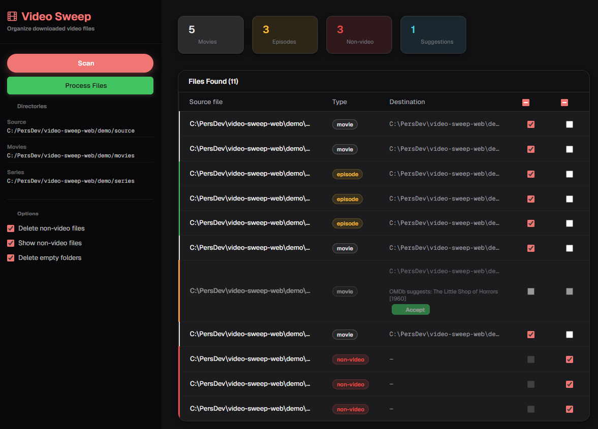
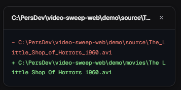
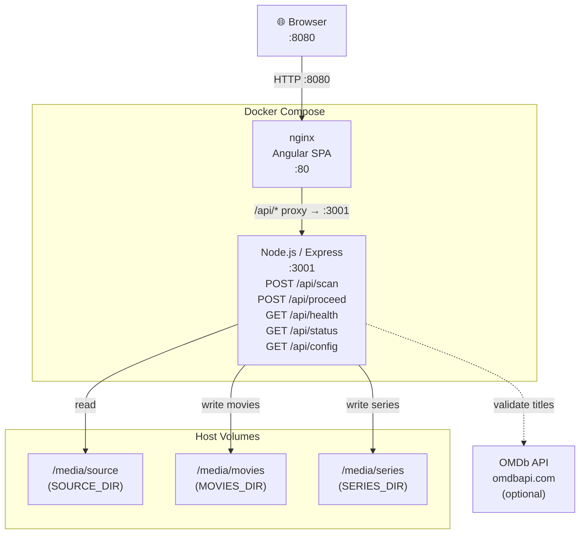

# video-sweep-web

A browser-based variant of my [video-sweep](https://github.com/colinmakerofthings/video-sweep) tool. I run it in Docker and use it to scan, classify, rename, and move newly downloaded video files. The UI is mobile-friendly, with a slide-in sidebar and a card-based results layout on smaller screens.

## How it works

1. **Scan** - press the Scan button; the backend walks the `/media/source` volume, classifies each video as a *movie* or *series episode*, and generates standardised target filenames
2. **Review** - results appear in a table with original file, type, new filename, and destination path. If `OMDB_API_KEY` is set, movies also show an OMDb validation column
3. **Proceed** - if you are happy with the plan, press Proceed; files are moved to `/media/movies` or `/media/series` and empty source folders are cleaned up



## Quick start

> **Try the demo first** — the `demo/` directory contains a ready-made set of placeholder video files (empty files) covering all supported naming conventions and file types. See [`demo/README.md`](demo/README.md) for instructions.

Deployment is driven by `docker-compose.yml`. You need to supply four environment variables:

| Variable | Required | Example |
| --- | --- | --- |
| `SOURCE_DIR` | Yes | `/mnt/downloads` |
| `MOVIES_DIR` | Yes | `/mnt/movies` |
| `SERIES_DIR` | Yes | `/mnt/tv` |
| `OMDB_API_KEY` | No | *(leave blank to disable OMDb validation)* |

### Via Docker Compose

```bash
git clone https://github.com/colinmakerofthings/video-sweep-web.git
cd video-sweep-web
cp .env.example .env
```

Edit `.env` with your directory paths and optional API key, then:

```bash
docker compose up --build -d
```

### Via a stack manager (Portainer, Dockge, etc.)

Create a new stack from the Git repository `https://github.com/colinmakerofthings/video-sweep-web`, using `docker-compose.yml` as the compose file. Set the environment variables above in your stack manager's UI, then deploy.

---

Open `http://<your-host-ip>:8080` in a browser.

## Naming conventions

### Movies

Input: `Gullivers.Travels.1939.1080p.BluRay.mkv`
Output: `Gulliver's Travels [1939].mkv` → `$MOVIES_DIR/Gulliver's Travels [1939].mkv`

### TV Series

Input: `The.Lone.Ranger.S01E01.mkv`
Output: `The Lone Ranger S01E01.mkv` → `$SERIES_DIR/The Lone Ranger/Season 1/The Lone Ranger S01E01.mkv`

## Optional: OMDb validation

### Getting a free API key

1. Go to <https://www.omdbapi.com/apikey.aspx> and select the **FREE** tier (1,000 requests/day) - OMDb will email you an activation link and your key.
2. Add the key to your environment:

   ```env
   OMDB_API_KEY=your_key_here
   ```

### What happens with the key set

When `OMDB_API_KEY` is set, each movie row is validated against OMDb:

| OMDb result | What you see |
| --- | --- |
| Title confirmed | Row appears normally |
| Different canonical title found | Row is highlighted; the Destination cell shows the OMDb suggestion and an **Accept** button to apply it |
| No match returned | Row appears unchanged |

The backend first attempts a direct title lookup; if that returns no result it falls back to a fuzzy search using progressively shorter title substrings.

Clicking a movie row opens a git-style diff popup, showing the original filename and the OMDb-suggested canonical title side-by-side:



### What happens without the key

If `OMDB_API_KEY` is left blank (the default):

- **No requests** are made to the OMDb API
- OMDb name validation is skipped - no inline warnings or suggestions will appear in the results

## Environment variables

| Variable | Required | Description |
| --- | --- | --- |
| `SOURCE_DIR` | Yes | Host path mounted as `/media/source` inside the container |
| `MOVIES_DIR` | Yes | Host path mounted as `/media/movies` |
| `SERIES_DIR` | Yes | Host path mounted as `/media/series` |
| `OMDB_API_KEY` | No | Free OMDb API key; leave blank to disable title validation. Free tier: 1,000 req/day. Get one at <https://www.omdbapi.com/apikey.aspx> |

## Architecture



## Development (without Docker)

### Backend

```powershell
cd backend
npm install
# PowerShell: set environment variables
$env:SOURCE_DIR = "C:/path/to/source"
$env:MOVIES_DIR = "C:/path/to/movies"
$env:SERIES_DIR = "C:/path/to/series"
npm run dev
```

### Frontend

```bash
cd frontend
npm install
npm start
```

Then open `http://localhost:4200`. The Angular dev server proxies `/api/*` to `http://localhost:3001` via the included `proxy.conf.json`.

## API reference

### `GET /api/health`

Liveness check. Returns `{ "status": "ok" }`.

### `GET /api/status`

Returns the number of video files currently present in `SOURCE_DIR`. Does not classify or call OMDb — it only counts, so it is fast and cheap to poll.

```json
{ "count": 42 }
```

`count` is the number of pending video files (`.mp4`, `.mkv`, `.avi`, `.m4v`). Non-video files are excluded.

### `GET /api/config`

Returns the directory paths currently configured via environment variables. Useful for confirming that volumes are mounted correctly.

```json
{ "sourceDir": "/media/source", "moviesDir": "/media/movies", "seriesDir": "/media/series" }
```

### `POST /api/scan`

Scans `SOURCE_DIR`, classifies each file, generates target filenames, and validates movie titles against OMDb (if `OMDB_API_KEY` is set). No request body required.

Returns a `rows` array. Each row has: `file`, `type` (`movie` | `series` | `delete`), `action` (`move` | `delete` | `skip`), `newFilename`, `targetPath`, `valid` (`Yes` | `No` | `-`), `suggested`.

### `POST /api/proceed`

Executes the planned moves and deletes. Accepts the `rows` array from `/api/scan` (with any user-modified `action` values) and an optional `deleteEmptyFolders` flag (default `true`).

```json
{ "rows": [...], "deleteEmptyFolders": true }
```

Responds as a Server-Sent Events stream (`text/event-stream`). Two event types:

```text
data: {"type":"progress","current":1,"total":10}

data: {"type":"done","moved":9,"deleted":1,"errors":[],"failedFiles":[]}
```

## Testing

Both backend and frontend use [Vitest](https://vitest.dev/).

### Backend Testing

```bash
cd backend
npm test            # single run
npm run test:watch  # watch mode
```

Tests cover the classifier, renamer, and file-finder modules.

### Frontend Testing

```bash
cd frontend
npm test
```

Tests cover component logic including action toggling, OMDb suggestion acceptance, computed counts, and select-all state.

## CI

GitHub Actions runs both test suites on every push to `master` and on pull requests. See `.github/workflows/ci.yml`.
