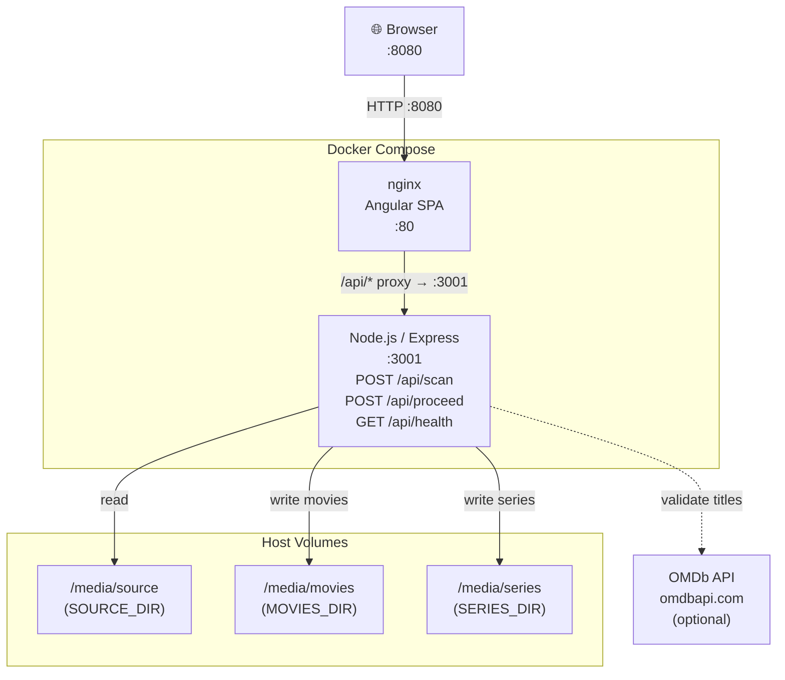

# video-sweep-web

A web-based variant of [video-sweep](https://github.com/colinmakerofthings/video-sweep) — scan, classify, and rename video files from a browser UI. Runs as a Docker Compose app on your Raspberry Pi 5 (or any Docker host).

## How it works

1. **Scan** — press the Scan button; the backend walks the `/media/source` volume, classifies each video as a *movie* or *series episode*, and generates standardised target filenames
2. **Review** — results appear in a table with original file, type, new filename, and destination path. If `OMDB_API_KEY` is set, movies also show an OMDb validation column
3. **Proceed** — if you are happy with the plan, press Proceed; files are moved to `/media/movies` or `/media/series` and empty source folders are cleaned up

## Quick start

### 1. Clone the repo

```bash
git clone https://github.com/yourname/video-sweep-web.git
cd video-sweep-web
```

### 2. Configure

```bash
cp .env.example .env
```

Edit `.env` and set the three directory paths and (optionally) your OMDb API key:

```env
SOURCE_DIR=/mnt/downloads      # where your downloaded video files live
MOVIES_DIR=/mnt/movies         # where movies should be moved
SERIES_DIR=/mnt/tv             # where TV series episodes should be moved
OMDB_API_KEY=                  # optional free key from omdbapi.com
```

### 3. Build and run

```bash
docker compose up --build -d
```

Open `http://<your-pi-ip>:8080` in a browser.

## Naming conventions

### Movies

Input: `The.Dark.Knight.2008.1080p.BluRay.mkv`
Output: `The Dark Knight [2008].mkv` → `$MOVIES_DIR/The Dark Knight [2008].mkv`

### TV Series

Input: `Breaking.Bad.S01E01.Pilot.mkv`
Output: `Breaking Bad S01E01.mkv` → `$SERIES_DIR/Breaking Bad/Season 1/Breaking Bad S01E01.mkv`

## Optional: OMDb validation

When `OMDB_API_KEY` is set, movie rows show two extra columns in the scan table:

| Column | Meaning |
| --- | --- |
| **Valid** | `Yes` — OMDb confirmed the title; `No` — OMDb found a different canonical title; `-` — no result |
| **Suggested Name** | The canonical OMDb title, e.g. `The Dark Knight [2008]` |

Get a free API key at <https://www.omdbapi.com/apikey.aspx>.

## Environment variables

| Variable | Required | Description |
| --- | --- | --- |
| `SOURCE_DIR` | Yes | Host path mounted as `/media/source` inside the container |
| `MOVIES_DIR` | Yes | Host path mounted as `/media/movies` |
| `SERIES_DIR` | Yes | Host path mounted as `/media/series` |
| `OMDB_API_KEY` | No | OMDb API key; leave blank to disable validation |

## Architecture



## Development (without Docker)

### Backend

```bash
cd backend
npm install
# Set environment variables
$env:SOURCE_DIR = "C:/path/to/source"
$env:MOVIES_DIR = "C:/path/to/movies"
$env:SERIES_DIR = "C:/path/to/series"
npm run dev
```

### Frontend

```bash
cd frontend
npm install
npm start
```

Then open `http://localhost:4200`. The Angular dev server proxies `/api/*` to `http://localhost:3001` — add a `proxy.conf.json` if needed.
